# PyNova OS — Architecture Design Document (ADD)

**Version:** 1.0  
**Status:** Approved  
**Project:** PyNova Operating System Simulation  
**Date:** 2026  
**Authors:** PyNova Engineering Team

---

## Table of Contents

1. [Introduction](#1-introduction)
2. [Architectural Goals & Constraints](#2-architectural-goals--constraints)
3. [System Context Diagram](#3-system-context-diagram)
4. [High-Level Layered Architecture](#4-high-level-layered-architecture)
5. [Component Architecture Diagram](#5-component-architecture-diagram)
6. [Package / Module Structure](#6-package--module-structure)
7. [Class Diagrams](#7-class-diagrams)
   - 7.1 Simulation Kernel
   - 7.2 Process & Thread Management
   - 7.3 CPU Scheduler — Strategy Pattern
   - 7.4 Synchronisation Primitives
   - 7.5 Deadlock Management
   - 7.6 Memory Management
   - 7.7 Virtual Memory & Page Replacement
   - 7.8 File System
   - 7.9 I/O Subsystem
   - 7.10 Security & Protection
   - 7.11 Virtual Machine Hypervisor
8. [Sequence Diagrams](#8-sequence-diagrams)
   - 8.1 Process Creation (fork/exec)
   - 8.2 CPU Scheduling Cycle
   - 8.3 Page Fault Handling
   - 8.4 File Open & Read
   - 8.5 Deadlock Detection
9. [State Diagrams](#9-state-diagrams)
   - 9.1 Process State Machine
   - 9.2 Page Table Entry State
   - 9.3 File Descriptor State
   - 9.4 Virtual Machine Lifecycle
10. [Data Flow Diagrams](#10-data-flow-diagrams)
    - 10.1 System Call Data Flow
    - 10.2 I/O Request Data Flow
11. [Entity-Relationship Diagram](#11-entity-relationship-diagram)
12. [Deployment Diagram](#12-deployment-diagram)
13. [Architectural Decisions & Rationale](#13-architectural-decisions--rationale)
14. [Interface Specifications](#14-interface-specifications)
15. [Glossary](#15-glossary)

---

## 1. Introduction

### 1.1 Purpose

This Architecture Design Document (ADD) describes the complete software architecture of **PyNova OS** — a Python-based simulation of a modern operating system. It covers all structural, behavioural, and deployment aspects of the system and provides UML diagrams for every major subsystem.

### 1.2 Scope

PyNova OS simulates all canonical OS components covered in Silberschatz *Operating System Concepts* (chapters 2–16):

- OS Structures & System Calls
- Process & Thread Management
- CPU Scheduling & Synchronisation
- Deadlock Detection, Avoidance & Recovery
- Main Memory & Virtual Memory Management
- Mass Storage & Disk Scheduling
- File System Interface & Implementation
- I/O Subsystem
- Protection & Security
- Virtual Machine Hypervisor

### 1.3 Architectural Style

PyNova OS is built on three complementary architectural styles:

| Style | Where Applied |
|---|---|
| **Layered Architecture** | Overall system structure (Presentation → API → Core → Resource → VM → Kernel) |
| **Strategy / Plugin Pattern** | All swappable algorithms (schedulers, page replacement, disk scheduling) |
| **Observer / Event-Bus Pattern** | Cross-component communication (page fault, process termination events) |
| **Singleton Pattern** | Simulation Kernel, Event Bus, Simulation Clock |
| **Factory Pattern** | PCB, TCB, Inode, FileDescriptor creation |

---

## 2. Architectural Goals & Constraints

### 2.1 Quality Attribute Goals

| Quality Attribute | Goal | Mechanism |
|---|---|---|
| **Modularity** | Each OS subsystem is independently testable and deployable | Strict package boundaries; interface-only cross-module calls |
| **Extensibility** | New algorithms added without modifying existing code | Strategy Pattern with ABC interfaces |
| **Observability** | Every simulation step is loggable at configurable verbosity | Event Bus with Logger subscriber |
| **Accuracy** | Algorithm outputs match textbook examples | Reference tests against Silberschatz worked examples |
| **Performance** | 100 processes scheduled in < 500 ms | Efficient data structures (heaps, bitmaps, hash tables) |
| **Portability** | Runs on Windows, Linux, macOS | Pure Python 3.10+; no OS-specific calls |

### 2.2 Constraints

- Python 3.10+ only; no C extensions in core simulation
- No real hardware I/O; all interaction is simulated in-memory
- Python GIL limits true parallelism; logical concurrency is managed via simulation clock
- No real network stack in v1.0

---

## 3. System Context Diagram

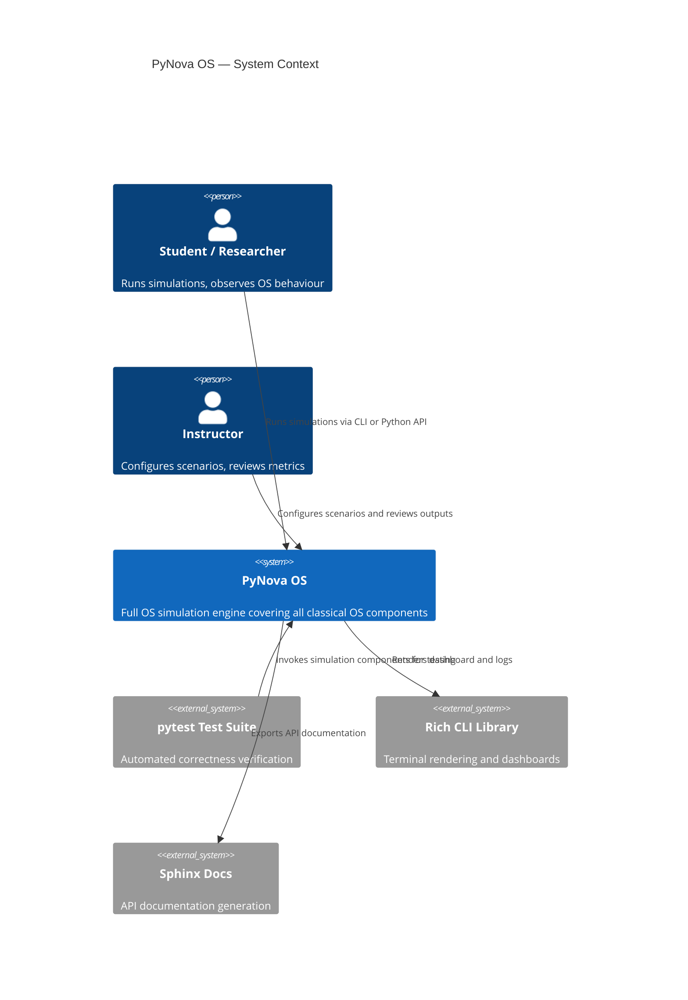
```mermaid
C4Context
    title PyNova OS — System Context

    Person(student, "Student / Researcher", "Runs simulations, observes OS behaviour")
    Person(instructor, "Instructor", "Configures scenarios, reviews metrics")

    System(pynova, "PyNova OS", "Full OS simulation engine covering all classical OS components")

    System_Ext(pytest, "pytest Test Suite", "Automated correctness verification")
    System_Ext(rich, "Rich CLI Library", "Terminal rendering and dashboards")
    System_Ext(sphinx, "Sphinx Docs", "API documentation generation")

    Rel(student, pynova, "Runs simulations via CLI or Python API")
    Rel(instructor, pynova, "Configures scenarios and reviews outputs")
    Rel(pynova, rich, "Renders dashboard and logs")
    Rel(pytest, pynova, "Invokes simulation components for testing")
    Rel(pynova, sphinx, "Exports API documentation")
```

---

## 4. High-Level Layered Architecture

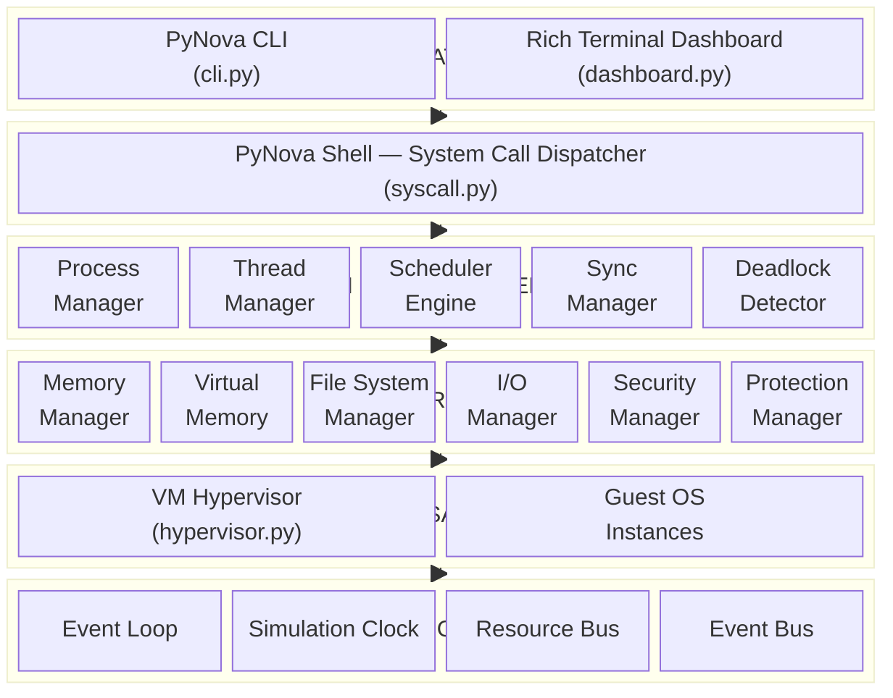
```mermaid
block-beta
  columns 1

  block:presentation["🖥️  PRESENTATION LAYER"]:1
    CLI["PyNova CLI\n(cli.py)"]
    Dashboard["Rich Terminal Dashboard\n(dashboard.py)"]
  end

  block:api["⚙️  API / SERVICE LAYER"]:1
    Shell["PyNova Shell — System Call Dispatcher\n(syscall.py)"]
  end

  block:core["🔧  OS CORE LAYER"]:1
    PM["Process\nManager"]
    TM["Thread\nManager"]
    SE["Scheduler\nEngine"]
    SM["Sync\nManager"]
    DD["Deadlock\nDetector"]
  end

  block:resource["💾  RESOURCE LAYER"]:1
    MM["Memory\nManager"]
    VM["Virtual\nMemory"]
    FS["File System\nManager"]
    IO["I/O\nManager"]
    SEC["Security\nManager"]
    PROT["Protection\nManager"]
  end

  block:virt["☁️  VIRTUALISATION LAYER"]:1
    HV["VM Hypervisor\n(hypervisor.py)"]
    Guest["Guest OS\nInstances"]
  end

  block:kernel["⚡  SIMULATION KERNEL"]:1
    EL["Event Loop"]
    CLK["Simulation Clock"]
    RB["Resource Bus"]
    EB["Event Bus"]
  end

  presentation --> api
  api --> core
  core --> resource
  resource --> virt
  virt --> kernel
```

---

## 5. Component Architecture Diagram

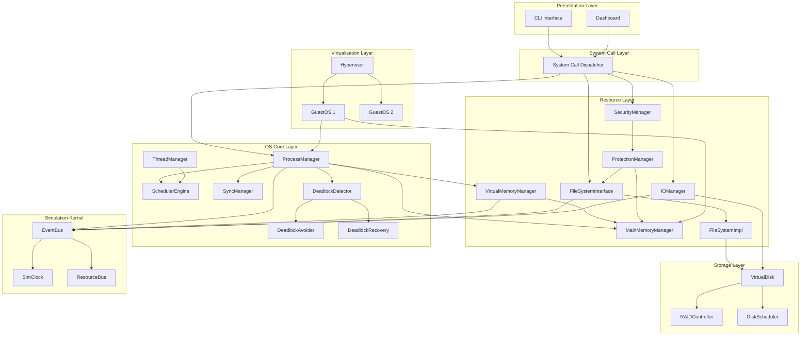
```mermaid
graph TB
    subgraph UI["Presentation Layer"]
        CLI[CLI Interface]
        DASH[Dashboard]
    end

    subgraph API["System Call Layer"]
        SCD[System Call Dispatcher]
    end

    subgraph CORE["OS Core Layer"]
        PM[ProcessManager]
        TM[ThreadManager]
        SCH[SchedulerEngine]
        SYN[SyncManager]
        DL[DeadlockDetector]
        DLA[DeadlockAvoider]
        DLR[DeadlockRecovery]
    end

    subgraph RESOURCE["Resource Layer"]
        MMGR[MainMemoryManager]
        VMM[VirtualMemoryManager]
        FSI[FileSystemInterface]
        FSImpl[FileSystemImpl]
        IOM[IOManager]
        PROT[ProtectionManager]
        SEC[SecurityManager]
    end

    subgraph STORAGE["Storage Layer"]
        DISK[VirtualDisk]
        RAID[RAIDController]
        DSCHED[DiskScheduler]
    end

    subgraph VM["Virtualisation Layer"]
        HYP[Hypervisor]
        GUEST1[GuestOS 1]
        GUEST2[GuestOS 2]
    end

    subgraph KERNEL["Simulation Kernel"]
        EV[EventBus]
        CLK[SimClock]
        RB[ResourceBus]
    end

    CLI --> SCD
    DASH --> SCD
    SCD --> PM
    SCD --> FSI
    SCD --> IOM
    SCD --> SEC

    PM --> SCH
    PM --> SYN
    PM --> DL
    TM --> SCH
    DL --> DLA
    DL --> DLR

    PM --> MMGR
    PM --> VMM
    VMM --> MMGR
    FSI --> FSImpl
    FSImpl --> DISK
    DISK --> DSCHED
    DISK --> RAID
    IOM --> DISK

    PROT --> FSI
    PROT --> MMGR
    SEC --> PROT

    HYP --> GUEST1
    HYP --> GUEST2
    GUEST1 --> PM
    GUEST1 --> MMGR

    PM --> EV
    VMM --> EV
    FSI --> EV
    IOM --> EV
    EV --> CLK
    EV --> RB
```

---

## 6. Package / Module Structure

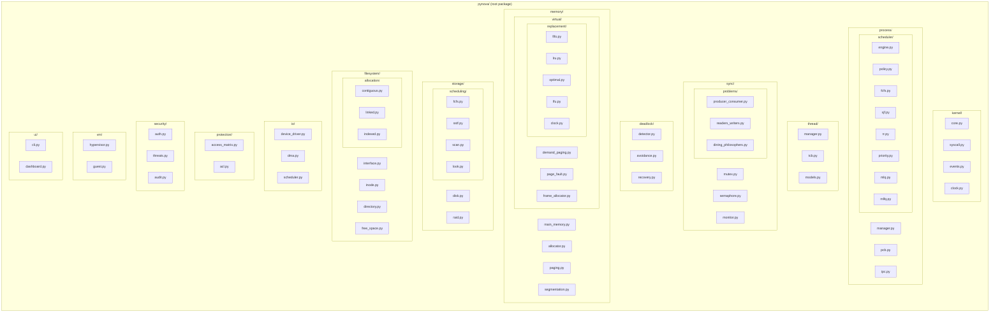
```mermaid
graph LR
    subgraph pynova["pynova/ (root package)"]
        subgraph kernel_pkg["kernel/"]
            K1[core.py]
            K2[syscall.py]
            K3[events.py]
            K4[clock.py]
        end

        subgraph process_pkg["process/"]
            P1[manager.py]
            P2[pcb.py]
            P3[ipc.py]
            subgraph sched_pkg["scheduler/"]
                S1[engine.py]
                S2[policy.py]
                S3[fcfs.py]
                S4[sjf.py]
                S5[rr.py]
                S6[priority.py]
                S7[mlq.py]
                S8[mlfq.py]
            end
        end

        subgraph thread_pkg["thread/"]
            T1[manager.py]
            T2[tcb.py]
            T3[models.py]
        end

        subgraph sync_pkg["sync/"]
            SY1[mutex.py]
            SY2[semaphore.py]
            SY3[monitor.py]
            subgraph prob_pkg["problems/"]
                PR1[producer_consumer.py]
                PR2[readers_writers.py]
                PR3[dining_philosophers.py]
            end
        end

        subgraph deadlock_pkg["deadlock/"]
            D1[detector.py]
            D2[avoidance.py]
            D3[recovery.py]
        end

        subgraph memory_pkg["memory/"]
            M1[main_memory.py]
            M2[allocator.py]
            M3[paging.py]
            M4[segmentation.py]
            subgraph virtual_pkg["virtual/"]
                V1[demand_paging.py]
                V2[page_fault.py]
                V3[frame_allocator.py]
                subgraph replace_pkg["replacement/"]
                    R1[fifo.py]
                    R2[lru.py]
                    R3[optimal.py]
                    R4[lfu.py]
                    R5[clock.py]
                end
            end
        end

        subgraph storage_pkg["storage/"]
            ST1[disk.py]
            ST2[raid.py]
            subgraph dsched_pkg["scheduling/"]
                DS1[fcfs.py]
                DS2[sstf.py]
                DS3[scan.py]
                DS4[look.py]
            end
        end

        subgraph fs_pkg["filesystem/"]
            F1[interface.py]
            F2[inode.py]
            F3[directory.py]
            F4[free_space.py]
            subgraph alloc_pkg["allocation/"]
                A1[contiguous.py]
                A2[linked.py]
                A3[indexed.py]
            end
        end

        subgraph io_pkg["io/"]
            IO1[device_driver.py]
            IO2[dma.py]
            IO3[scheduler.py]
        end

        subgraph prot_pkg["protection/"]
            PT1[access_matrix.py]
            PT2[acl.py]
        end

        subgraph sec_pkg["security/"]
            SE1[auth.py]
            SE2[threats.py]
            SE3[audit.py]
        end

        subgraph vm_pkg["vm/"]
            VM1[hypervisor.py]
            VM2[guest.py]
        end

        subgraph ui_pkg["ui/"]
            UI1[cli.py]
            UI2[dashboard.py]
        end
    end
```

---

## 7. Class Diagrams

### 7.1 Simulation Kernel

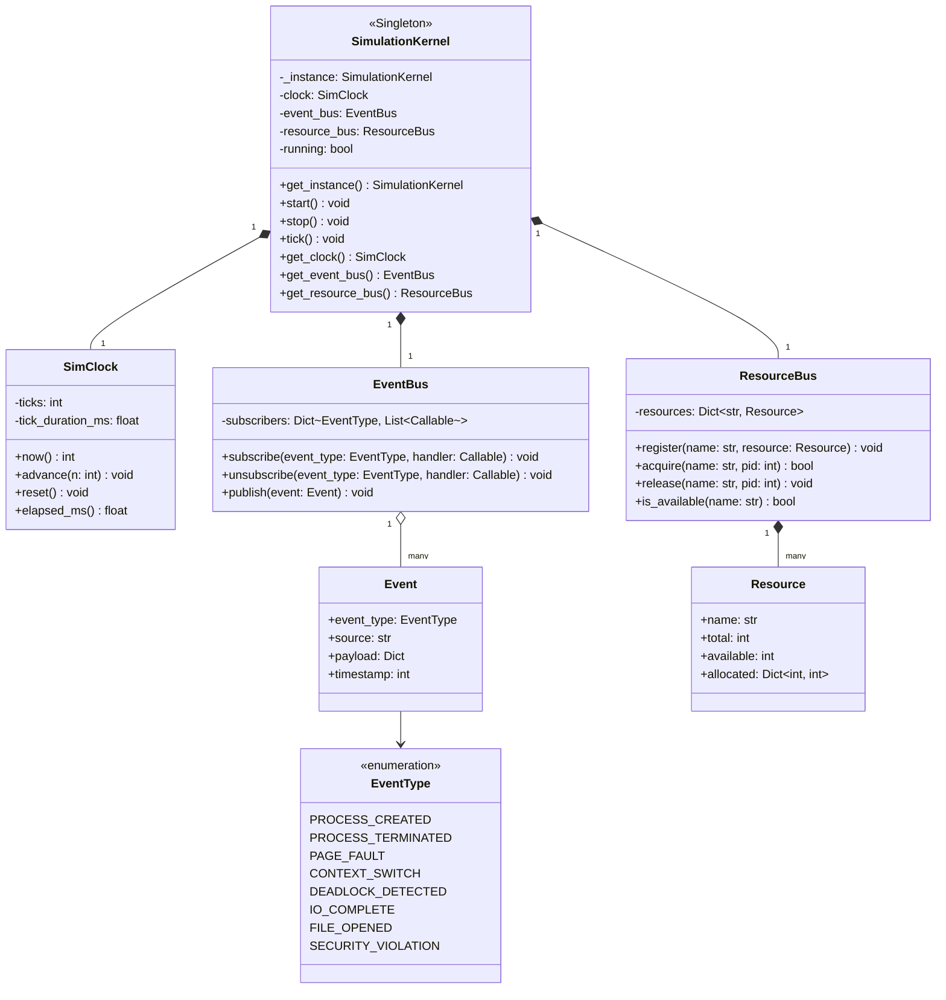
```mermaid
classDiagram
    class SimulationKernel {
        <<Singleton>>
        -_instance: SimulationKernel
        -clock: SimClock
        -event_bus: EventBus
        -resource_bus: ResourceBus
        -running: bool
        +get_instance() SimulationKernel
        +start() void
        +stop() void
        +tick() void
        +get_clock() SimClock
        +get_event_bus() EventBus
        +get_resource_bus() ResourceBus
    }

    class SimClock {
        -ticks: int
        -tick_duration_ms: float
        +now() int
        +advance(n: int) void
        +reset() void
        +elapsed_ms() float
    }

    class EventBus {
        -subscribers: Dict~EventType, List~Callable~~
        +subscribe(event_type: EventType, handler: Callable) void
        +unsubscribe(event_type: EventType, handler: Callable) void
        +publish(event: Event) void
    }

    class Event {
        +event_type: EventType
        +source: str
        +payload: Dict
        +timestamp: int
    }

    class EventType {
        <<enumeration>>
        PROCESS_CREATED
        PROCESS_TERMINATED
        PAGE_FAULT
        CONTEXT_SWITCH
        DEADLOCK_DETECTED
        IO_COMPLETE
        FILE_OPENED
        SECURITY_VIOLATION
    }

    class ResourceBus {
        -resources: Dict~str, Resource~
        +register(name: str, resource: Resource) void
        +acquire(name: str, pid: int) bool
        +release(name: str, pid: int) void
        +is_available(name: str) bool
    }

    class Resource {
        +name: str
        +total: int
        +available: int
        +allocated: Dict~int, int~
    }

    SimulationKernel "1" *-- "1" SimClock
    SimulationKernel "1" *-- "1" EventBus
    SimulationKernel "1" *-- "1" ResourceBus
    EventBus "1" o-- "many" Event
    Event --> EventType
    ResourceBus "1" *-- "many" Resource
```

---

### 7.2 Process & Thread Management

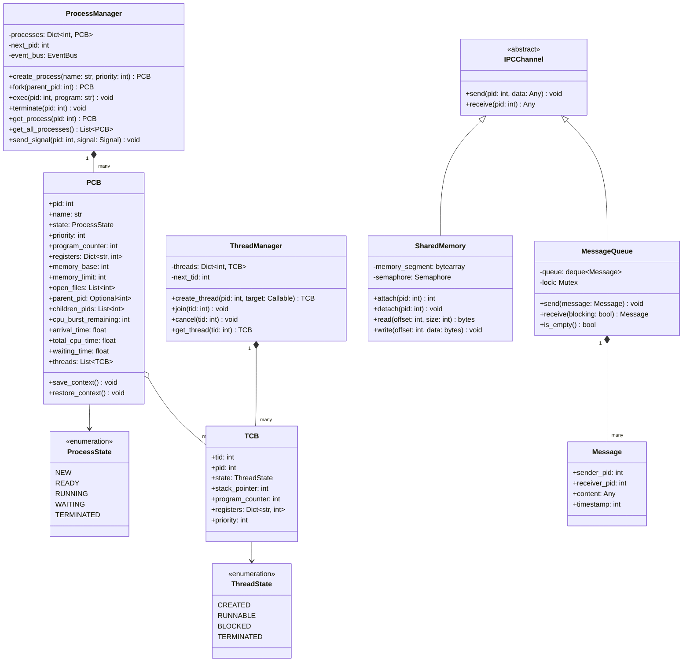
```mermaid
classDiagram
    class ProcessManager {
        -processes: Dict~int, PCB~
        -next_pid: int
        -event_bus: EventBus
        +create_process(name: str, priority: int) PCB
        +fork(parent_pid: int) PCB
        +exec(pid: int, program: str) void
        +terminate(pid: int) void
        +get_process(pid: int) PCB
        +get_all_processes() List~PCB~
        +send_signal(pid: int, signal: Signal) void
    }

    class PCB {
        +pid: int
        +name: str
        +state: ProcessState
        +priority: int
        +program_counter: int
        +registers: Dict~str, int~
        +memory_base: int
        +memory_limit: int
        +open_files: List~int~
        +parent_pid: Optional~int~
        +children_pids: List~int~
        +cpu_burst_remaining: int
        +arrival_time: float
        +total_cpu_time: float
        +waiting_time: float
        +threads: List~TCB~
        +save_context() void
        +restore_context() void
    }

    class ProcessState {
        <<enumeration>>
        NEW
        READY
        RUNNING
        WAITING
        TERMINATED
    }

    class ThreadManager {
        -threads: Dict~int, TCB~
        -next_tid: int
        +create_thread(pid: int, target: Callable) TCB
        +join(tid: int) void
        +cancel(tid: int) void
        +get_thread(tid: int) TCB
    }

    class TCB {
        +tid: int
        +pid: int
        +state: ThreadState
        +stack_pointer: int
        +program_counter: int
        +registers: Dict~str, int~
        +priority: int
    }

    class ThreadState {
        <<enumeration>>
        CREATED
        RUNNABLE
        BLOCKED
        TERMINATED
    }

    class IPCChannel {
        <<abstract>>
        +send(pid: int, data: Any) void
        +receive(pid: int) Any
    }

    class SharedMemory {
        -memory_segment: bytearray
        -semaphore: Semaphore
        +attach(pid: int) int
        +detach(pid: int) void
        +read(offset: int, size: int) bytes
        +write(offset: int, data: bytes) void
    }

    class MessageQueue {
        -queue: deque~Message~
        -lock: Mutex
        +send(message: Message) void
        +receive(blocking: bool) Message
        +is_empty() bool
    }

    class Message {
        +sender_pid: int
        +receiver_pid: int
        +content: Any
        +timestamp: int
    }

    ProcessManager "1" *-- "many" PCB
    PCB --> ProcessState
    PCB "1" o-- "many" TCB
    ThreadManager "1" *-- "many" TCB
    TCB --> ThreadState
    IPCChannel <|-- SharedMemory
    IPCChannel <|-- MessageQueue
    MessageQueue "1" *-- "many" Message
```

---

### 7.3 CPU Scheduler — Strategy Pattern

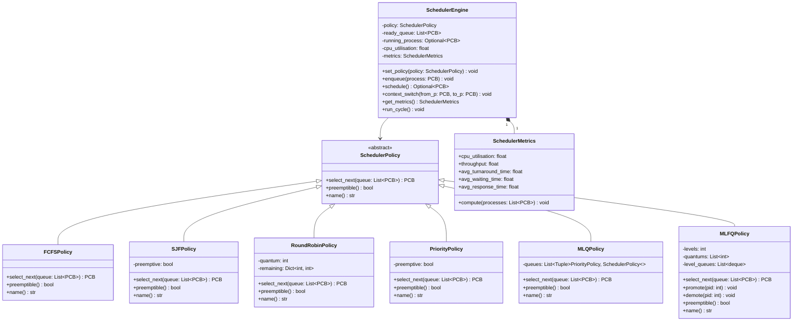
```mermaid
classDiagram
    class SchedulerEngine {
        -policy: SchedulerPolicy
        -ready_queue: List~PCB~
        -running_process: Optional~PCB~
        -cpu_utilisation: float
        -metrics: SchedulerMetrics
        +set_policy(policy: SchedulerPolicy) void
        +enqueue(process: PCB) void
        +schedule() Optional~PCB~
        +context_switch(from_p: PCB, to_p: PCB) void
        +get_metrics() SchedulerMetrics
        +run_cycle() void
    }

    class SchedulerPolicy {
        <<abstract>>
        +select_next(queue: List~PCB~) PCB
        +preemptible() bool
        +name() str
    }

    class FCFSPolicy {
        +select_next(queue: List~PCB~) PCB
        +preemptible() bool
        +name() str
    }

    class SJFPolicy {
        -preemptive: bool
        +select_next(queue: List~PCB~) PCB
        +preemptible() bool
        +name() str
    }

    class RoundRobinPolicy {
        -quantum: int
        -remaining: Dict~int, int~
        +select_next(queue: List~PCB~) PCB
        +preemptible() bool
        +name() str
    }

    class PriorityPolicy {
        -preemptive: bool
        +select_next(queue: List~PCB~) PCB
        +preemptible() bool
        +name() str
    }

    class MLQPolicy {
        -queues: List~Tuple~PriorityPolicy, SchedulerPolicy~~
        +select_next(queue: List~PCB~) PCB
        +preemptible() bool
        +name() str
    }

    class MLFQPolicy {
        -levels: int
        -quantums: List~int~
        -level_queues: List~deque~
        +select_next(queue: List~PCB~) PCB
        +promote(pid: int) void
        +demote(pid: int) void
        +preemptible() bool
        +name() str
    }

    class SchedulerMetrics {
        +cpu_utilisation: float
        +throughput: float
        +avg_turnaround_time: float
        +avg_waiting_time: float
        +avg_response_time: float
        +compute(processes: List~PCB~) void
    }

    SchedulerEngine --> SchedulerPolicy
    SchedulerEngine "1" *-- "1" SchedulerMetrics
    SchedulerPolicy <|-- FCFSPolicy
    SchedulerPolicy <|-- SJFPolicy
    SchedulerPolicy <|-- RoundRobinPolicy
    SchedulerPolicy <|-- PriorityPolicy
    SchedulerPolicy <|-- MLQPolicy
    SchedulerPolicy <|-- MLFQPolicy
```

---

### 7.4 Synchronisation Primitives

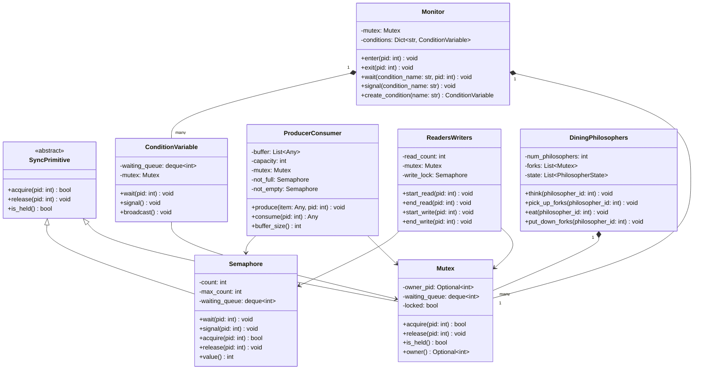
```mermaid
classDiagram
    class SyncPrimitive {
        <<abstract>>
        +acquire(pid: int) bool
        +release(pid: int) void
        +is_held() bool
    }

    class Mutex {
        -owner_pid: Optional~int~
        -waiting_queue: deque~int~
        -locked: bool
        +acquire(pid: int) bool
        +release(pid: int) void
        +is_held() bool
        +owner() Optional~int~
    }

    class Semaphore {
        -count: int
        -max_count: int
        -waiting_queue: deque~int~
        +wait(pid: int) void
        +signal(pid: int) void
        +acquire(pid: int) bool
        +release(pid: int) void
        +value() int
    }

    class ConditionVariable {
        -waiting_queue: deque~int~
        -mutex: Mutex
        +wait(pid: int) void
        +signal() void
        +broadcast() void
    }

    class Monitor {
        -mutex: Mutex
        -conditions: Dict~str, ConditionVariable~
        +enter(pid: int) void
        +exit(pid: int) void
        +wait(condition_name: str, pid: int) void
        +signal(condition_name: str) void
        +create_condition(name: str) ConditionVariable
    }

    class ProducerConsumer {
        -buffer: List~Any~
        -capacity: int
        -mutex: Mutex
        -not_full: Semaphore
        -not_empty: Semaphore
        +produce(item: Any, pid: int) void
        +consume(pid: int) Any
        +buffer_size() int
    }

    class ReadersWriters {
        -read_count: int
        -mutex: Mutex
        -write_lock: Semaphore
        +start_read(pid: int) void
        +end_read(pid: int) void
        +start_write(pid: int) void
        +end_write(pid: int) void
    }

    class DiningPhilosophers {
        -num_philosophers: int
        -forks: List~Mutex~
        -state: List~PhilosopherState~
        +think(philosopher_id: int) void
        +pick_up_forks(philosopher_id: int) void
        +eat(philosopher_id: int) void
        +put_down_forks(philosopher_id: int) void
    }

    SyncPrimitive <|-- Mutex
    SyncPrimitive <|-- Semaphore
    Monitor "1" *-- "1" Mutex
    Monitor "1" *-- "many" ConditionVariable
    ConditionVariable --> Mutex
    ProducerConsumer --> Mutex
    ProducerConsumer --> Semaphore
    ReadersWriters --> Mutex
    ReadersWriters --> Semaphore
    DiningPhilosophers "1" *-- "many" Mutex
```

---

### 7.5 Deadlock Management

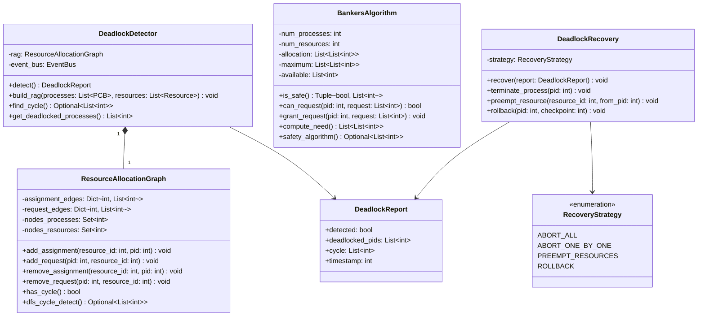
```mermaid
classDiagram
    class DeadlockDetector {
        -rag: ResourceAllocationGraph
        -event_bus: EventBus
        +detect() DeadlockReport
        +build_rag(processes: List~PCB~, resources: List~Resource~) void
        +find_cycle() Optional~List~int~~
        +get_deadlocked_processes() List~int~
    }

    class ResourceAllocationGraph {
        -assignment_edges: Dict~int, List~int~~
        -request_edges: Dict~int, List~int~~
        -nodes_processes: Set~int~
        -nodes_resources: Set~int~
        +add_assignment(resource_id: int, pid: int) void
        +add_request(pid: int, resource_id: int) void
        +remove_assignment(resource_id: int, pid: int) void
        +remove_request(pid: int, resource_id: int) void
        +has_cycle() bool
        +dfs_cycle_detect() Optional~List~int~~
    }

    class BankersAlgorithm {
        -num_processes: int
        -num_resources: int
        -allocation: List~List~int~~
        -maximum: List~List~int~~
        -available: List~int~
        +is_safe() Tuple~bool, List~int~~
        +can_request(pid: int, request: List~int~) bool
        +grant_request(pid: int, request: List~int~) void
        +compute_need() List~List~int~~
        +safety_algorithm() Optional~List~int~~
    }

    class DeadlockRecovery {
        -strategy: RecoveryStrategy
        +recover(report: DeadlockReport) void
        +terminate_process(pid: int) void
        +preempt_resource(resource_id: int, from_pid: int) void
        +rollback(pid: int, checkpoint: int) void
    }

    class RecoveryStrategy {
        <<enumeration>>
        ABORT_ALL
        ABORT_ONE_BY_ONE
        PREEMPT_RESOURCES
        ROLLBACK
    }

    class DeadlockReport {
        +detected: bool
        +deadlocked_pids: List~int~
        +cycle: List~int~
        +timestamp: int
    }

    DeadlockDetector "1" *-- "1" ResourceAllocationGraph
    DeadlockDetector --> DeadlockReport
    DeadlockRecovery --> DeadlockReport
    DeadlockRecovery --> RecoveryStrategy
```

---

### 7.6 Memory Management

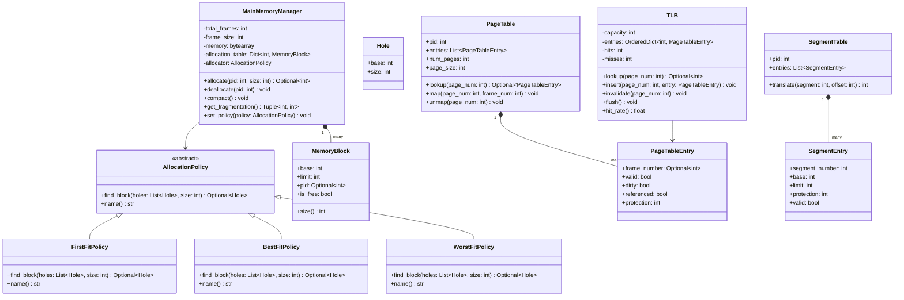
```mermaid
classDiagram
    class MainMemoryManager {
        -total_frames: int
        -frame_size: int
        -memory: bytearray
        -allocation_table: Dict~int, MemoryBlock~
        -allocator: AllocationPolicy
        +allocate(pid: int, size: int) Optional~int~
        +deallocate(pid: int) void
        +compact() void
        +get_fragmentation() Tuple~int, int~
        +set_policy(policy: AllocationPolicy) void
    }

    class AllocationPolicy {
        <<abstract>>
        +find_block(holes: List~Hole~, size: int) Optional~Hole~
        +name() str
    }

    class FirstFitPolicy {
        +find_block(holes: List~Hole~, size: int) Optional~Hole~
        +name() str
    }

    class BestFitPolicy {
        +find_block(holes: List~Hole~, size: int) Optional~Hole~
        +name() str
    }

    class WorstFitPolicy {
        +find_block(holes: List~Hole~, size: int) Optional~Hole~
        +name() str
    }

    class MemoryBlock {
        +base: int
        +limit: int
        +pid: Optional~int~
        +is_free: bool
        +size() int
    }

    class Hole {
        +base: int
        +size: int
    }

    class PageTable {
        +pid: int
        +entries: List~PageTableEntry~
        +num_pages: int
        +page_size: int
        +lookup(page_num: int) Optional~PageTableEntry~
        +map(page_num: int, frame_num: int) void
        +unmap(page_num: int) void
    }

    class PageTableEntry {
        +frame_number: Optional~int~
        +valid: bool
        +dirty: bool
        +referenced: bool
        +protection: int
    }

    class TLB {
        -capacity: int
        -entries: OrderedDict~int, PageTableEntry~
        -hits: int
        -misses: int
        +lookup(page_num: int) Optional~int~
        +insert(page_num: int, entry: PageTableEntry) void
        +invalidate(page_num: int) void
        +flush() void
        +hit_rate() float
    }

    class SegmentTable {
        +pid: int
        +entries: List~SegmentEntry~
        +translate(segment: int, offset: int) int
    }

    class SegmentEntry {
        +segment_number: int
        +base: int
        +limit: int
        +protection: int
        +valid: bool
    }

    MainMemoryManager --> AllocationPolicy
    MainMemoryManager "1" *-- "many" MemoryBlock
    AllocationPolicy <|-- FirstFitPolicy
    AllocationPolicy <|-- BestFitPolicy
    AllocationPolicy <|-- WorstFitPolicy
    PageTable "1" *-- "many" PageTableEntry
    TLB --> PageTableEntry
    SegmentTable "1" *-- "many" SegmentEntry
```

---

### 7.7 Virtual Memory & Page Replacement

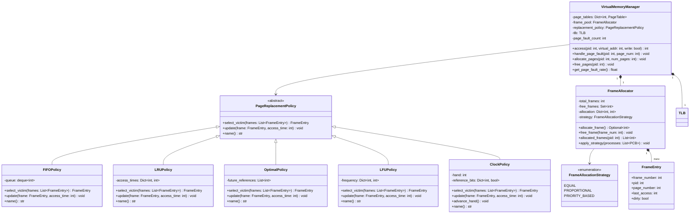
```mermaid
classDiagram
    class VirtualMemoryManager {
        -page_tables: Dict~int, PageTable~
        -frame_pool: FrameAllocator
        -replacement_policy: PageReplacementPolicy
        -tlb: TLB
        -page_fault_count: int
        +access(pid: int, virtual_addr: int, write: bool) int
        +handle_page_fault(pid: int, page_num: int) void
        +allocate_pages(pid: int, num_pages: int) void
        +free_pages(pid: int) void
        +get_page_fault_rate() float
    }

    class FrameAllocator {
        -total_frames: int
        -free_frames: Set~int~
        -allocation: Dict~int, int~
        -strategy: FrameAllocationStrategy
        +allocate_frame() Optional~int~
        +free_frame(frame_num: int) void
        +allocated_frames(pid: int) List~int~
        +apply_strategy(processes: List~PCB~) void
    }

    class FrameAllocationStrategy {
        <<enumeration>>
        EQUAL
        PROPORTIONAL
        PRIORITY_BASED
    }

    class PageReplacementPolicy {
        <<abstract>>
        +select_victim(frames: List~FrameEntry~) FrameEntry
        +update(frame: FrameEntry, access_time: int) void
        +name() str
    }

    class FIFOPolicy {
        -queue: deque~int~
        +select_victim(frames: List~FrameEntry~) FrameEntry
        +update(frame: FrameEntry, access_time: int) void
        +name() str
    }

    class LRUPolicy {
        -access_times: Dict~int, int~
        +select_victim(frames: List~FrameEntry~) FrameEntry
        +update(frame: FrameEntry, access_time: int) void
        +name() str
    }

    class OptimalPolicy {
        -future_references: List~int~
        +select_victim(frames: List~FrameEntry~) FrameEntry
        +update(frame: FrameEntry, access_time: int) void
        +name() str
    }

    class LFUPolicy {
        -frequency: Dict~int, int~
        +select_victim(frames: List~FrameEntry~) FrameEntry
        +update(frame: FrameEntry, access_time: int) void
        +name() str
    }

    class ClockPolicy {
        -hand: int
        -reference_bits: Dict~int, bool~
        +select_victim(frames: List~FrameEntry~) FrameEntry
        +update(frame: FrameEntry, access_time: int) void
        +advance_hand() void
        +name() str
    }

    class FrameEntry {
        +frame_number: int
        +pid: int
        +page_number: int
        +last_access: int
        +dirty: bool
    }

    VirtualMemoryManager --> PageReplacementPolicy
    VirtualMemoryManager "1" *-- "1" FrameAllocator
    VirtualMemoryManager "1" *-- "1" TLB
    FrameAllocator --> FrameAllocationStrategy
    PageReplacementPolicy <|-- FIFOPolicy
    PageReplacementPolicy <|-- LRUPolicy
    PageReplacementPolicy <|-- OptimalPolicy
    PageReplacementPolicy <|-- LFUPolicy
    PageReplacementPolicy <|-- ClockPolicy
    FrameAllocator "1" *-- "many" FrameEntry
```

---

### 7.8 File System

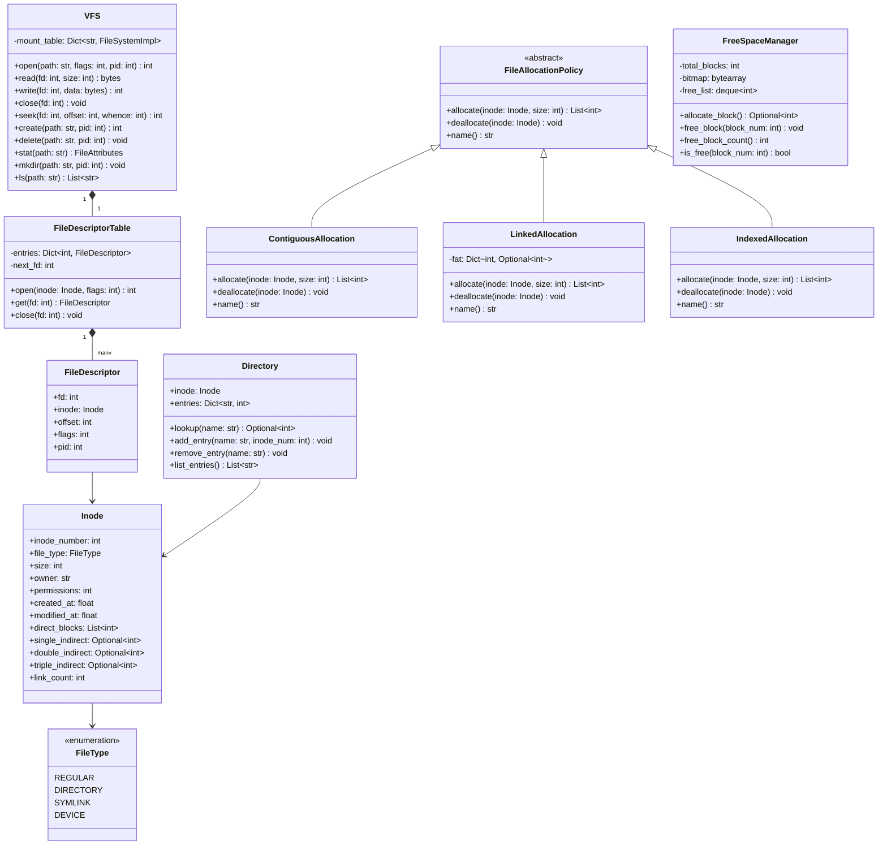
```mermaid
classDiagram
    class VFS {
        -mount_table: Dict~str, FileSystemImpl~
        +open(path: str, flags: int, pid: int) int
        +read(fd: int, size: int) bytes
        +write(fd: int, data: bytes) int
        +close(fd: int) void
        +seek(fd: int, offset: int, whence: int) int
        +create(path: str, pid: int) int
        +delete(path: str, pid: int) void
        +stat(path: str) FileAttributes
        +mkdir(path: str, pid: int) void
        +ls(path: str) List~str~
    }

    class FileDescriptorTable {
        -entries: Dict~int, FileDescriptor~
        -next_fd: int
        +open(inode: Inode, flags: int) int
        +get(fd: int) FileDescriptor
        +close(fd: int) void
    }

    class FileDescriptor {
        +fd: int
        +inode: Inode
        +offset: int
        +flags: int
        +pid: int
    }

    class Inode {
        +inode_number: int
        +file_type: FileType
        +size: int
        +owner: str
        +permissions: int
        +created_at: float
        +modified_at: float
        +direct_blocks: List~int~
        +single_indirect: Optional~int~
        +double_indirect: Optional~int~
        +triple_indirect: Optional~int~
        +link_count: int
    }

    class FileType {
        <<enumeration>>
        REGULAR
        DIRECTORY
        SYMLINK
        DEVICE
    }

    class Directory {
        +inode: Inode
        +entries: Dict~str, int~
        +lookup(name: str) Optional~int~
        +add_entry(name: str, inode_num: int) void
        +remove_entry(name: str) void
        +list_entries() List~str~
    }

    class FileAllocationPolicy {
        <<abstract>>
        +allocate(inode: Inode, size: int) List~int~
        +deallocate(inode: Inode) void
        +name() str
    }

    class ContiguousAllocation {
        +allocate(inode: Inode, size: int) List~int~
        +deallocate(inode: Inode) void
        +name() str
    }

    class LinkedAllocation {
        -fat: Dict~int, Optional~int~~
        +allocate(inode: Inode, size: int) List~int~
        +deallocate(inode: Inode) void
        +name() str
    }

    class IndexedAllocation {
        +allocate(inode: Inode, size: int) List~int~
        +deallocate(inode: Inode) void
        +name() str
    }

    class FreeSpaceManager {
        -total_blocks: int
        -bitmap: bytearray
        -free_list: deque~int~
        +allocate_block() Optional~int~
        +free_block(block_num: int) void
        +free_block_count() int
        +is_free(block_num: int) bool
    }

    VFS "1" *-- "1" FileDescriptorTable
    FileDescriptorTable "1" *-- "many" FileDescriptor
    FileDescriptor --> Inode
    Inode --> FileType
    Directory --> Inode
    FileAllocationPolicy <|-- ContiguousAllocation
    FileAllocationPolicy <|-- LinkedAllocation
    FileAllocationPolicy <|-- IndexedAllocation
```

---

### 7.9 I/O Subsystem

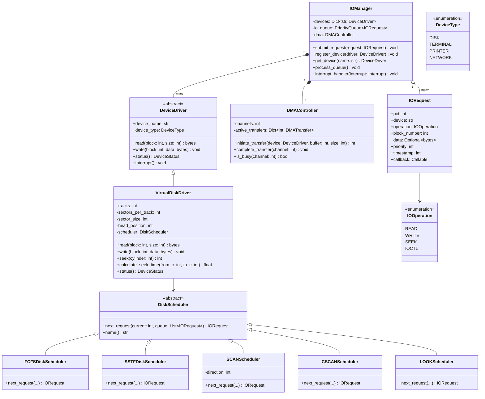
```mermaid
classDiagram
    class IOManager {
        -devices: Dict~str, DeviceDriver~
        -io_queue: PriorityQueue~IORequest~
        -dma: DMAController
        +submit_request(request: IORequest) void
        +register_device(driver: DeviceDriver) void
        +get_device(name: str) DeviceDriver
        +process_queue() void
        +interrupt_handler(interrupt: Interrupt) void
    }

    class DeviceDriver {
        <<abstract>>
        +device_name: str
        +device_type: DeviceType
        +read(block: int, size: int) bytes
        +write(block: int, data: bytes) void
        +status() DeviceStatus
        +interrupt() void
    }

    class VirtualDiskDriver {
        -tracks: int
        -sectors_per_track: int
        -sector_size: int
        -head_position: int
        -scheduler: DiskScheduler
        +read(block: int, size: int) bytes
        +write(block: int, data: bytes) void
        +seek(cylinder: int) int
        +calculate_seek_time(from_c: int, to_c: int) float
        +status() DeviceStatus
    }

    class DiskScheduler {
        <<abstract>>
        +next_request(current: int, queue: List~IORequest~) IORequest
        +name() str
    }

    class FCFSDiskScheduler { +next_request(...) IORequest }
    class SSTFDiskScheduler { +next_request(...) IORequest }
    class SCANScheduler { -direction: int
        +next_request(...) IORequest }
    class CSCANScheduler { +next_request(...) IORequest }
    class LOOKScheduler { +next_request(...) IORequest }

    class DMAController {
        -channels: int
        -active_transfers: Dict~int, DMATransfer~
        +initiate_transfer(device: DeviceDriver, buffer: int, size: int) int
        +complete_transfer(channel: int) void
        +is_busy(channel: int) bool
    }

    class IORequest {
        +pid: int
        +device: str
        +operation: IOOperation
        +block_number: int
        +data: Optional~bytes~
        +priority: int
        +timestamp: int
        +callback: Callable
    }

    class IOOperation {
        <<enumeration>>
        READ
        WRITE
        SEEK
        IOCTL
    }

    class DeviceType {
        <<enumeration>>
        DISK
        TERMINAL
        PRINTER
        NETWORK
    }

    IOManager "1" *-- "many" DeviceDriver
    IOManager "1" *-- "1" DMAController
    IOManager "1" o-- "many" IORequest
    DeviceDriver <|-- VirtualDiskDriver
    VirtualDiskDriver --> DiskScheduler
    DiskScheduler <|-- FCFSDiskScheduler
    DiskScheduler <|-- SSTFDiskScheduler
    DiskScheduler <|-- SCANScheduler
    DiskScheduler <|-- CSCANScheduler
    DiskScheduler <|-- LOOKScheduler
    IORequest --> IOOperation
```

---

### 7.10 Security & Protection

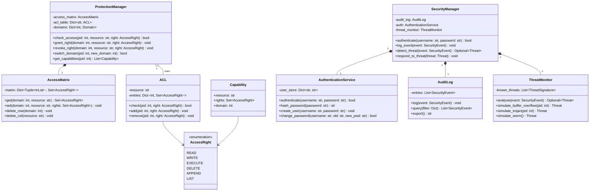
```mermaid
classDiagram
    class ProtectionManager {
        -access_matrix: AccessMatrix
        -acl_table: Dict~str, ACL~
        -domains: Dict~int, Domain~
        +check_access(pid: int, resource: str, right: AccessRight) bool
        +grant_right(domain: int, resource: str, right: AccessRight) void
        +revoke_right(domain: int, resource: str, right: AccessRight) void
        +switch_domain(pid: int, new_domain: int) bool
        +get_capabilities(pid: int) List~Capability~
    }

    class AccessMatrix {
        -matrix: Dict~Tuple~int,str~, Set~AccessRight~~
        +get(domain: int, resource: str) Set~AccessRight~
        +set(domain: int, resource: str, rights: Set~AccessRight~) void
        +delete_row(domain: int) void
        +delete_col(resource: str) void
    }

    class ACL {
        -resource: str
        -entries: Dict~int, Set~AccessRight~~
        +check(pid: int, right: AccessRight) bool
        +add(pid: int, right: AccessRight) void
        +remove(pid: int, right: AccessRight) void
    }

    class Capability {
        +resource: str
        +rights: Set~AccessRight~
        +domain: int
    }

    class AccessRight {
        <<enumeration>>
        READ
        WRITE
        EXECUTE
        DELETE
        APPEND
        LIST
    }

    class SecurityManager {
        -audit_log: AuditLog
        -auth: AuthenticationService
        -threat_monitor: ThreatMonitor
        +authenticate(username: str, password: str) bool
        +log_event(event: SecurityEvent) void
        +detect_threat(event: SecurityEvent) Optional~Threat~
        +respond_to_threat(threat: Threat) void
    }

    class AuthenticationService {
        -user_store: Dict~str, str~
        +authenticate(username: str, password: str) bool
        +hash_password(password: str) str
        +create_user(username: str, password: str) void
        +change_password(username: str, old: str, new_pwd: str) bool
    }

    class AuditLog {
        -entries: List~SecurityEvent~
        +log(event: SecurityEvent) void
        +query(filter: Dict) List~SecurityEvent~
        +export() str
    }

    class ThreatMonitor {
        -known_threats: List~ThreatSignature~
        +analyse(event: SecurityEvent) Optional~Threat~
        +simulate_buffer_overflow(pid: int) Threat
        +simulate_trojan(pid: int) Threat
        +simulate_worm() Threat
    }

    ProtectionManager "1" *-- "1" AccessMatrix
    ProtectionManager "1" o-- "many" ACL
    ACL --> AccessRight
    Capability --> AccessRight
    SecurityManager "1" *-- "1" AuditLog
    SecurityManager "1" *-- "1" AuthenticationService
    SecurityManager "1" *-- "1" ThreatMonitor
```

---

### 7.11 Virtual Machine Hypervisor

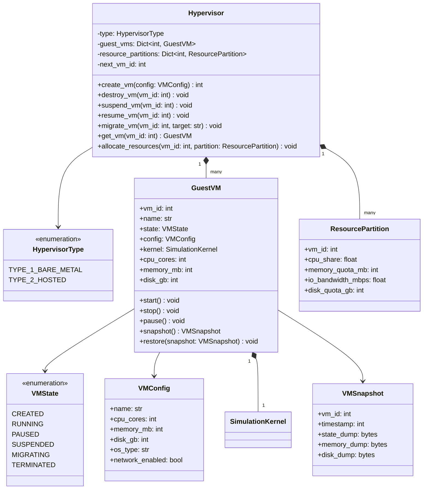
```mermaid
classDiagram
    class Hypervisor {
        -type: HypervisorType
        -guest_vms: Dict~int, GuestVM~
        -resource_partitions: Dict~int, ResourcePartition~
        -next_vm_id: int
        +create_vm(config: VMConfig) int
        +destroy_vm(vm_id: int) void
        +suspend_vm(vm_id: int) void
        +resume_vm(vm_id: int) void
        +migrate_vm(vm_id: int, target: str) void
        +get_vm(vm_id: int) GuestVM
        +allocate_resources(vm_id: int, partition: ResourcePartition) void
    }

    class HypervisorType {
        <<enumeration>>
        TYPE_1_BARE_METAL
        TYPE_2_HOSTED
    }

    class GuestVM {
        +vm_id: int
        +name: str
        +state: VMState
        +config: VMConfig
        +kernel: SimulationKernel
        +cpu_cores: int
        +memory_mb: int
        +disk_gb: int
        +start() void
        +stop() void
        +pause() void
        +snapshot() VMSnapshot
        +restore(snapshot: VMSnapshot) void
    }

    class VMState {
        <<enumeration>>
        CREATED
        RUNNING
        PAUSED
        SUSPENDED
        MIGRATING
        TERMINATED
    }

    class VMConfig {
        +name: str
        +cpu_cores: int
        +memory_mb: int
        +disk_gb: int
        +os_type: str
        +network_enabled: bool
    }

    class ResourcePartition {
        +vm_id: int
        +cpu_share: float
        +memory_quota_mb: int
        +io_bandwidth_mbps: float
        +disk_quota_gb: int
    }

    class VMSnapshot {
        +vm_id: int
        +timestamp: int
        +state_dump: bytes
        +memory_dump: bytes
        +disk_dump: bytes
    }

    Hypervisor --> HypervisorType
    Hypervisor "1" *-- "many" GuestVM
    Hypervisor "1" *-- "many" ResourcePartition
    GuestVM --> VMState
    GuestVM --> VMConfig
    GuestVM "1" *-- "1" SimulationKernel
    GuestVM --> VMSnapshot
```

---

## 8. Sequence Diagrams

### 8.1 Process Creation (fork/exec)

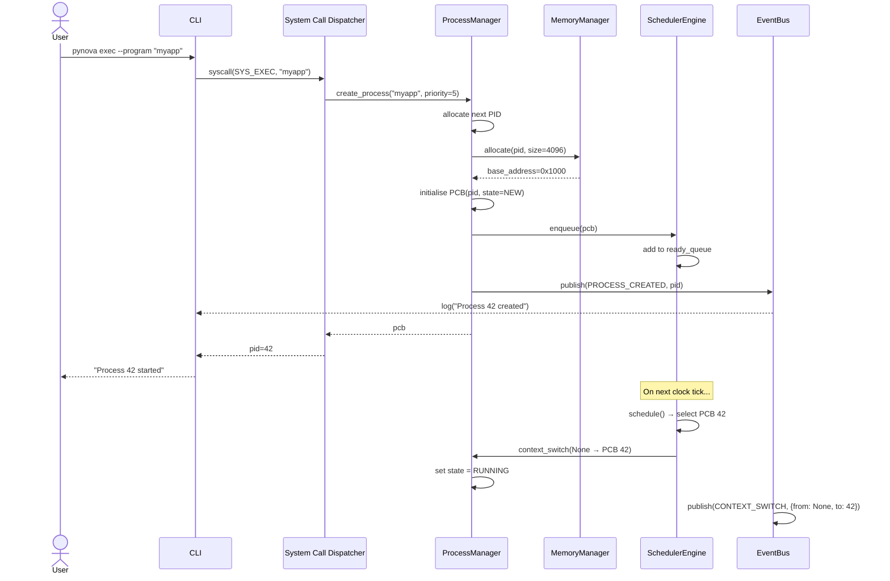
```mermaid
sequenceDiagram
    actor User
    participant CLI
    participant SysCall as System Call Dispatcher
    participant PM as ProcessManager
    participant MM as MemoryManager
    participant SCH as SchedulerEngine
    participant EB as EventBus

    User->>CLI: pynova exec --program "myapp"
    CLI->>SysCall: syscall(SYS_EXEC, "myapp")
    SysCall->>PM: create_process("myapp", priority=5)
    PM->>PM: allocate next PID
    PM->>MM: allocate(pid, size=4096)
    MM-->>PM: base_address=0x1000
    PM->>PM: initialise PCB(pid, state=NEW)
    PM->>SCH: enqueue(pcb)
    SCH->>SCH: add to ready_queue
    PM->>EB: publish(PROCESS_CREATED, pid)
    EB-->>CLI: log("Process 42 created")
    PM-->>SysCall: pcb
    SysCall-->>CLI: pid=42
    CLI-->>User: "Process 42 started"

    Note over SCH: On next clock tick...
    SCH->>SCH: schedule() → select PCB 42
    SCH->>PM: context_switch(None → PCB 42)
    PM->>PM: set state = RUNNING
    EB->>EB: publish(CONTEXT_SWITCH, {from: None, to: 42})
```

---

### 8.2 CPU Scheduling Cycle (Round Robin)

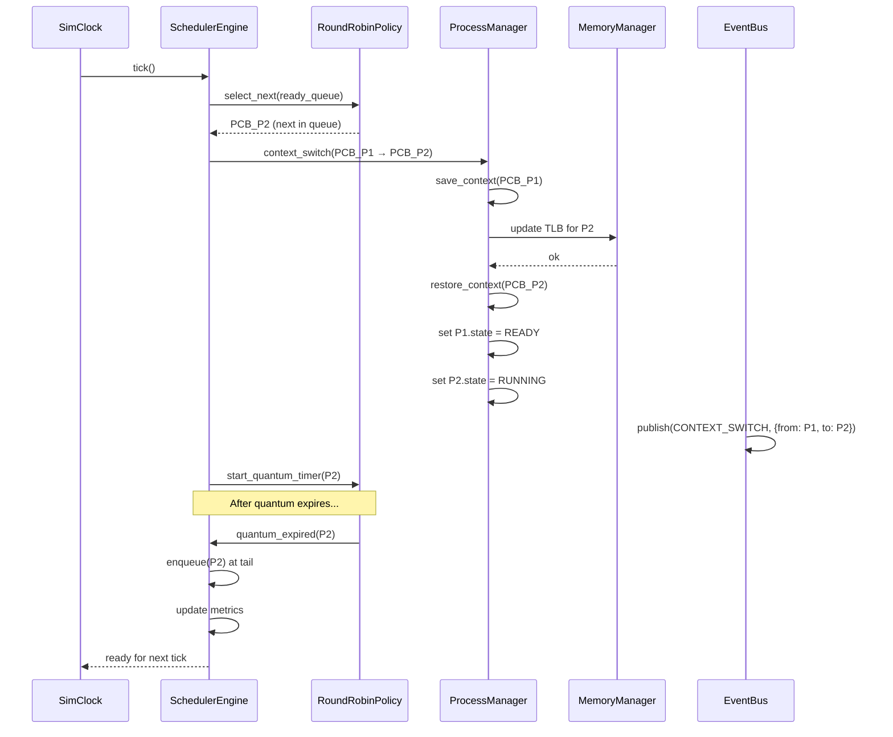
```mermaid
sequenceDiagram
    participant CLK as SimClock
    participant SCH as SchedulerEngine
    participant RR as RoundRobinPolicy
    participant PM as ProcessManager
    participant MM as MemoryManager
    participant EB as EventBus

    CLK->>SCH: tick()
    SCH->>RR: select_next(ready_queue)
    RR-->>SCH: PCB_P2 (next in queue)
    SCH->>PM: context_switch(PCB_P1 → PCB_P2)
    PM->>PM: save_context(PCB_P1)
    PM->>MM: update TLB for P2
    MM-->>PM: ok
    PM->>PM: restore_context(PCB_P2)
    PM->>PM: set P1.state = READY
    PM->>PM: set P2.state = RUNNING
    EB->>EB: publish(CONTEXT_SWITCH, {from: P1, to: P2})
    SCH->>RR: start_quantum_timer(P2)

    Note over SCH,RR: After quantum expires...
    RR->>SCH: quantum_expired(P2)
    SCH->>SCH: enqueue(P2) at tail
    SCH->>SCH: update metrics
    SCH-->>CLK: ready for next tick
```

---

### 8.3 Page Fault Handling

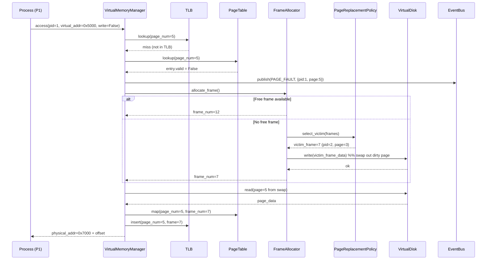
```mermaid
sequenceDiagram
    participant P as Process (P1)
    participant VM as VirtualMemoryManager
    participant TLB as TLB
    participant PT as PageTable
    participant FA as FrameAllocator
    participant REP as PageReplacementPolicy
    participant DISK as VirtualDisk
    participant EB as EventBus

    P->>VM: access(pid=1, virtual_addr=0x5000, write=False)
    VM->>TLB: lookup(page_num=5)
    TLB-->>VM: miss (not in TLB)
    VM->>PT: lookup(page_num=5)
    PT-->>VM: entry.valid = False
    VM->>EB: publish(PAGE_FAULT, {pid:1, page:5})

    VM->>FA: allocate_frame()
    alt Free frame available
        FA-->>VM: frame_num=12
    else No free frame
        FA->>REP: select_victim(frames)
        REP-->>FA: victim_frame=7 (pid=2, page=3)
        FA->>DISK: write(victim_frame_data)  %% swap out dirty page
        DISK-->>FA: ok
        FA-->>VM: frame_num=7
    end

    VM->>DISK: read(page=5 from swap)
    DISK-->>VM: page_data
    VM->>PT: map(page_num=5, frame_num=7)
    VM->>TLB: insert(page_num=5, frame=7)
    VM-->>P: physical_addr=0x7000 + offset
```

---

### 8.4 File Open & Read

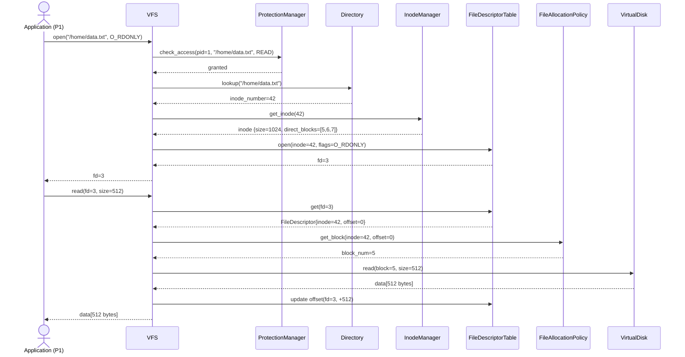
```mermaid
sequenceDiagram
    actor App as Application (P1)
    participant VFS as VFS
    participant PROT as ProtectionManager
    participant DIR as Directory
    participant INODE as InodeManager
    participant FDT as FileDescriptorTable
    participant ALLOC as FileAllocationPolicy
    participant DISK as VirtualDisk

    App->>VFS: open("/home/data.txt", O_RDONLY)
    VFS->>PROT: check_access(pid=1, "/home/data.txt", READ)
    PROT-->>VFS: granted
    VFS->>DIR: lookup("/home/data.txt")
    DIR-->>VFS: inode_number=42
    VFS->>INODE: get_inode(42)
    INODE-->>VFS: inode {size=1024, direct_blocks=[5,6,7]}
    VFS->>FDT: open(inode=42, flags=O_RDONLY)
    FDT-->>VFS: fd=3
    VFS-->>App: fd=3

    App->>VFS: read(fd=3, size=512)
    VFS->>FDT: get(fd=3)
    FDT-->>VFS: FileDescriptor{inode=42, offset=0}
    VFS->>ALLOC: get_block(inode=42, offset=0)
    ALLOC-->>VFS: block_num=5
    VFS->>DISK: read(block=5, size=512)
    DISK-->>VFS: data[512 bytes]
    VFS->>FDT: update offset(fd=3, +512)
    VFS-->>App: data[512 bytes]
```

---

### 8.5 Deadlock Detection & Recovery

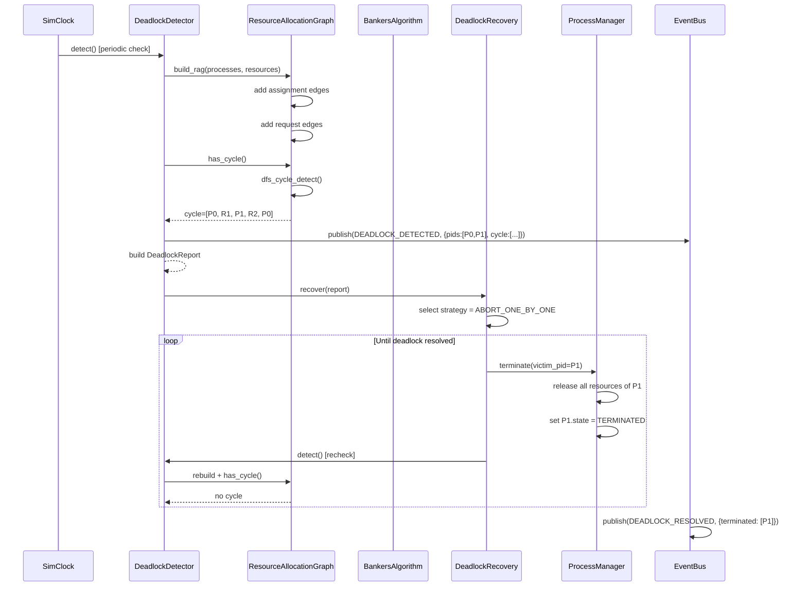
```mermaid
sequenceDiagram
    participant CLK as SimClock
    participant DD as DeadlockDetector
    participant RAG as ResourceAllocationGraph
    participant BK as BankersAlgorithm
    participant DR as DeadlockRecovery
    participant PM as ProcessManager
    participant EB as EventBus

    CLK->>DD: detect() [periodic check]
    DD->>RAG: build_rag(processes, resources)
    RAG->>RAG: add assignment edges
    RAG->>RAG: add request edges
    DD->>RAG: has_cycle()
    RAG->>RAG: dfs_cycle_detect()
    RAG-->>DD: cycle=[P0, R1, P1, R2, P0]

    DD->>EB: publish(DEADLOCK_DETECTED, {pids:[P0,P1], cycle:[...]})
    DD-->>DD: build DeadlockReport

    DD->>DR: recover(report)
    DR->>DR: select strategy = ABORT_ONE_BY_ONE

    loop Until deadlock resolved
        DR->>PM: terminate(victim_pid=P1)
        PM->>PM: release all resources of P1
        PM->>PM: set P1.state = TERMINATED
        DR->>DD: detect() [recheck]
        DD->>RAG: rebuild + has_cycle()
        RAG-->>DD: no cycle
    end

    EB->>EB: publish(DEADLOCK_RESOLVED, {terminated: [P1]})
```

---

## 9. State Diagrams

### 9.1 Process State Machine

```mermaid
stateDiagram-v2
    [*] --> New : create_process()

    New --> Ready : admitted to ready queue
    Ready --> Running : scheduler dispatches
    Running --> Ready : preempted / time quantum expired
    Running --> Waiting : I/O request / wait(semaphore)
    Running --> Terminated : exit() / kill signal
    Waiting --> Ready : I/O complete / signal(semaphore)
    Terminated --> [*]

    note right of Running
        Context saved in PCB
        CPU executing instructions
    end note

    note right of Waiting
        PCB moved to wait queue
        Blocked on resource
    end note
```

---

### 9.2 Page Table Entry State Machine

```mermaid
stateDiagram-v2
    [*] --> Invalid : process starts (no pages loaded)

    Invalid --> Valid_Clean : page loaded from disk (page fault resolved)
    Valid_Clean --> Valid_Dirty : process writes to page
    Valid_Dirty --> Invalid : page evicted, written to swap disk
    Valid_Clean --> Invalid : page evicted (no write needed)
    Valid_Clean --> Referenced : page accessed (reference bit set)
    Referenced --> Valid_Clean : clock hand clears reference bit
    Valid_Dirty --> Referenced : dirty page accessed again

    note right of Valid_Dirty
        dirty=True
        Must write to swap before eviction
    end note
```

---

### 9.3 File Descriptor State Machine

```mermaid
stateDiagram-v2
    [*] --> Closed

    Closed --> Open : open(path, flags)
    Open --> Reading : read(fd, size)
    Open --> Writing : write(fd, data)
    Reading --> Open : read complete
    Writing --> Open : write complete
    Open --> Seeking : seek(fd, offset, whence)
    Seeking --> Open : seek complete
    Open --> Closed : close(fd)
    Reading --> Closed : close during read (flush)
    Writing --> Closed : close during write (flush + sync)
    Closed --> [*]
```

---

### 9.4 Virtual Machine Lifecycle

```mermaid
stateDiagram-v2
    [*] --> Created : hypervisor.create_vm(config)

    Created --> Running : vm.start()
    Running --> Paused : vm.pause()
    Paused --> Running : vm.resume()
    Running --> Suspended : vm.suspend() [snapshot saved]
    Suspended --> Running : vm.resume() [snapshot restored]
    Running --> Migrating : hypervisor.migrate_vm(target)
    Migrating --> Running : migration complete (on target)
    Running --> Terminated : vm.stop()
    Paused --> Terminated : vm.stop()
    Suspended --> Terminated : vm.stop()
    Terminated --> [*]
```

---

## 10. Data Flow Diagrams

### 10.1 System Call Data Flow

```mermaid
flowchart TD
    A([User Application]) -->|"syscall(SYS_WRITE, fd, buf, n)"| B[System Call Dispatcher]
    B -->|validate arguments| C{Argument Valid?}
    C -- No --> D[Return EINVAL]
    C -- Yes --> E[Protection Manager]
    E -->|check_access pid, resource, WRITE| F{Access Granted?}
    F -- No --> G[Return EPERM\nlog security event]
    F -- Yes --> H{Syscall Type}
    H -- SYS_WRITE --> I[VFS write]
    H -- SYS_READ --> J[VFS read]
    H -- SYS_FORK --> K[ProcessManager fork]
    H -- SYS_MMAP --> L[VirtualMemoryManager allocate]
    H -- SYS_IOCTL --> M[IOManager ioctl]
    I --> N[FileAllocationPolicy]
    N --> O[VirtualDisk write]
    O --> P[EventBus publish IO_COMPLETE]
    P --> Q([Return to User])
```

---

### 10.2 I/O Request Data Flow

```mermaid
flowchart LR
    A([Process]) -->|submit_request| B[IOManager]
    B -->|enqueue| C[I/O Priority Queue]
    C -->|dequeue highest priority| D{I/O Mode}
    D -- Polling --> E[Device Driver poll loop]
    D -- Interrupt-Driven --> F[Device Driver initiate]
    D -- DMA --> G[DMAController]
    E -->|complete| H[IOManager]
    F -->|device interrupt| I[Interrupt Handler]
    I --> H
    G -->|DMA transfer complete| H
    H -->|callback| J[Process unblock]
    H -->|log| K[EventBus IO_COMPLETE]
    J -->|state = READY| L[SchedulerEngine ready queue]
```

---

## 11. Entity-Relationship Diagram

```mermaid
erDiagram
    PROCESS {
        int pid PK
        string name
        string state
        int priority
        int memory_base
        int memory_limit
        float arrival_time
    }

    THREAD {
        int tid PK
        int pid FK
        string state
        int stack_pointer
        int program_counter
    }

    FILE {
        int inode_number PK
        string name
        string file_type
        int size
        string owner
        int permissions
        float created_at
        float modified_at
    }

    DIRECTORY {
        int inode_number PK
        string path
        int parent_inode FK
    }

    FILE_DESCRIPTOR {
        int fd PK
        int pid FK
        int inode_number FK
        int offset
        int flags
    }

    DISK_BLOCK {
        int block_number PK
        bool is_free
        int inode_number FK
    }

    FRAME {
        int frame_number PK
        int pid FK
        int page_number
        bool dirty
        bool referenced
        int last_access_time
    }

    PAGE_TABLE_ENTRY {
        int pid FK
        int page_number PK
        int frame_number FK
        bool valid
        bool dirty
        bool referenced
    }

    RESOURCE {
        int resource_id PK
        string name
        int total
        int available
    }

    ALLOCATION {
        int pid FK
        int resource_id FK
        int amount
    }

    VM_GUEST {
        int vm_id PK
        string name
        string state
        int cpu_cores
        int memory_mb
        int disk_gb
    }

    SECURITY_EVENT {
        int event_id PK
        int pid FK
        string event_type
        float timestamp
        string description
    }

    PROCESS ||--o{ THREAD : "has"
    PROCESS ||--o{ FILE_DESCRIPTOR : "opens"
    PROCESS ||--o{ PAGE_TABLE_ENTRY : "owns"
    PROCESS ||--o{ ALLOCATION : "holds"
    FILE_DESCRIPTOR }o--|| FILE : "references"
    FILE ||--o{ DISK_BLOCK : "stored in"
    DIRECTORY ||--o{ FILE : "contains"
    DIRECTORY ||--o{ DIRECTORY : "contains"
    PAGE_TABLE_ENTRY }o--|| FRAME : "maps to"
    RESOURCE ||--o{ ALLOCATION : "allocated via"
    VM_GUEST ||--o{ PROCESS : "hosts"
    PROCESS ||--o{ SECURITY_EVENT : "generates"
```

---

## 12. Deployment Diagram

```mermaid
graph TB
    subgraph HOST["Host Machine (Windows / Linux / macOS)"]
        subgraph PYTHON["Python 3.10+ Runtime"]
            subgraph PYNOVA["PyNova OS Process"]
                KERNEL[Simulation Kernel]
                CORE[OS Core Modules]
                RESOURCE[Resource Modules]
                VM[VM Hypervisor]
                UI[CLI / Dashboard]
            end
            subgraph TESTS["pytest Test Runner"]
                UNIT[Unit Tests]
                INTG[Integration Tests]
                PERF[Performance Tests]
            end
        end

        subgraph STORAGE_HOST["Host File System (read-only metadata)"]
            CONFIG[config.yaml]
            WORKLOAD[workload_scripts/]
            LOGS[simulation_logs/]
        end

        subgraph TOOLS["Dev Tools"]
            GIT[Git / GitHub]
            CI[GitHub Actions CI]
            SPHINX[Sphinx Doc Generator]
        end
    end

    PYNOVA -->|reads config| CONFIG
    PYNOVA -->|reads workloads| WORKLOAD
    PYNOVA -->|writes logs| LOGS
    TESTS --> PYNOVA
    CI --> TESTS
    CI --> SPHINX
    SPHINX --> LOGS
```

---

## 13. Architectural Decisions & Rationale

| ID | Decision | Rationale | Alternatives Rejected |
|---|---|---|---|
| **AD-01** | Layered Architecture | Mirrors real OS design; enforces dependency direction; each layer testable independently | Microservices (overkill for single-process simulation), flat module structure (no encapsulation) |
| **AD-02** | Strategy Pattern for algorithms | Enables runtime switching between FCFS/SJF/RR/Priority/MLQ/MLFQ and page replacement algorithms without modifying engine code | Hard-coded if/else chains (violates Open/Closed); function pointers (not Pythonic) |
| **AD-03** | Observer / Event Bus | Decouples cross-component reactions (page fault → logger, memory manager simultaneously) | Direct method calls (tight coupling); callbacks (harder to extend) |
| **AD-04** | Singleton Kernel | One simulation clock ensures deterministic, reproducible simulation state | Multiple kernel instances (inconsistent time; race conditions in simulation logic) |
| **AD-05** | In-memory simulation only | Portability (no real disk/device access); safety; testability | Real device I/O (platform-specific; dangerous in academic sandbox) |
| **AD-06** | Mermaid UML in Markdown | Renders natively on GitHub, GitLab, Notion; no separate tool required; version-controlled with code | PlantUML (requires Java; separate file); draw.io (binary format; not diffable) |
| **AD-07** | Python dataclasses for PCB/TCB/Inode | Clean, type-annotated, serialisable; IDE support; easy factory methods | Plain dicts (no type safety); namedtuples (immutable; limits state changes) |
| **AD-08** | Plugin interface via ABC | Forces implementers to provide required methods; caught at class definition time by Python | Protocol (structural typing only; runtime errors later); duck typing (no enforcement) |

---

## 14. Interface Specifications

### 14.1 SchedulerPolicy Interface

```python
from abc import ABC, abstractmethod
from typing import List

class SchedulerPolicy(ABC):
    @abstractmethod
    def select_next(self, ready_queue: List["PCB"]) -> "PCB":
        """Select the next process to run. Must not modify queue state beyond removal."""
        ...

    @abstractmethod
    def preemptible(self) -> bool:
        """Return True if this policy allows preemption of running processes."""
        ...

    @abstractmethod
    def name(self) -> str:
        """Human-readable name of this scheduling algorithm."""
        ...
```

### 14.2 PageReplacementPolicy Interface

```python
class PageReplacementPolicy(ABC):
    @abstractmethod
    def select_victim(self, frames: List["FrameEntry"]) -> "FrameEntry":
        """Select a frame to evict. frames contains all currently resident frames."""
        ...

    @abstractmethod
    def update(self, frame: "FrameEntry", access_time: int) -> None:
        """Notify policy of a frame access (for LRU, LFU, Clock tracking)."""
        ...

    @abstractmethod
    def name(self) -> str:
        """Human-readable name of this replacement algorithm."""
        ...
```

### 14.3 FileAllocationPolicy Interface

```python
class FileAllocationPolicy(ABC):
    @abstractmethod
    def allocate(self, inode: "Inode", size: int) -> List[int]:
        """Allocate disk blocks for size bytes. Returns list of block numbers."""
        ...

    @abstractmethod
    def deallocate(self, inode: "Inode") -> None:
        """Free all blocks associated with inode."""
        ...

    @abstractmethod
    def name(self) -> str:
        """Human-readable name of this allocation strategy."""
        ...
```

### 14.4 System Call Interface (selected calls)

| Syscall | Signature | Description |
|---|---|---|
| `SYS_FORK` | `fork() → int` | Create child process; return child PID |
| `SYS_EXEC` | `exec(program: str) → void` | Replace process image |
| `SYS_EXIT` | `exit(code: int) → void` | Terminate calling process |
| `SYS_WAIT` | `wait(pid: int) → int` | Wait for child; return exit code |
| `SYS_OPEN` | `open(path: str, flags: int) → int` | Open file; return fd |
| `SYS_READ` | `read(fd: int, size: int) → bytes` | Read from fd |
| `SYS_WRITE` | `write(fd: int, data: bytes) → int` | Write to fd; return bytes written |
| `SYS_CLOSE` | `close(fd: int) → void` | Close file descriptor |
| `SYS_MMAP` | `mmap(pid: int, size: int) → int` | Map virtual memory region |
| `SYS_MUNMAP` | `munmap(pid: int, addr: int) → void` | Unmap memory region |
| `SYS_SHMGET` | `shmget(size: int) → int` | Create shared memory segment |
| `SYS_IOCTL` | `ioctl(device: str, cmd: int, arg: Any) → int` | Device control |

---

## 15. Glossary

| Term | Definition |
|---|---|
| **PCB** | Process Control Block — data structure holding all state of a process |
| **TCB** | Thread Control Block — data structure holding all state of a thread |
| **TLB** | Translation Lookaside Buffer — hardware cache for page table entries |
| **RAG** | Resource Allocation Graph — directed graph used for deadlock detection |
| **MLFQ** | Multilevel Feedback Queue — adaptive scheduling algorithm that moves processes between priority levels |
| **DMA** | Direct Memory Access — mechanism for device-to-memory transfers without CPU involvement |
| **VFS** | Virtual File System — abstraction layer above concrete file system implementations |
| **FAT** | File Allocation Table — linked block allocation structure |
| **ACL** | Access Control List — per-resource list of permitted access rights per domain |
| **Inode** | Index Node — data structure storing file metadata and block pointers |
| **Thrashing** | State where excessive page faulting causes near-zero CPU productivity |
| **Banker's Algorithm** | Deadlock avoidance algorithm that checks system safety before granting resource requests |
| **Strategy Pattern** | Design pattern where algorithms are encapsulated as interchangeable objects |
| **Observer Pattern** | Design pattern where objects subscribe to events published by other objects |
| **Singleton** | Design pattern ensuring only one instance of a class exists in the application |

---

*Architecture Design Document v1.0 | PyNova OS | 2026*  
*All UML diagrams use Mermaid syntax — render in GitHub, GitLab, Notion, or VS Code with Mermaid extension*
